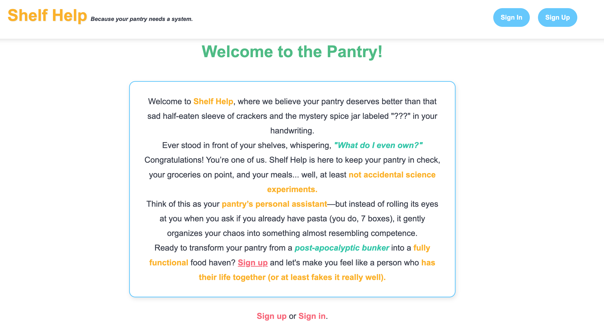

# 🥫 Shelf Help: The Pantry Organizer  

## **Overview**  
**Shelf Help** is a simple yet **essential CRUD (Create, Read, Update, Delete) app** designed to help track pantry items. It lays the foundation for understanding how **CRUD operations power most websites**, from managing user accounts to handling content updates.  

This project is structured to reinforce **MERN stack fundamentals**, focusing on **Express.js, MongoDB, and EJS for templating**. Every interaction with the pantry mirrors the real-world logic of adding, modifying, and organizing data—just like most **content-driven websites and applications**.

---

## **📸 Screenshot**  
  

---

## **🛠 Technologies Used**  
- **Back End**: Node.js, Express, MongoDB, Mongoose  
- **Front End**: HTML, CSS, EJS  
- **Authentication**: Express Sessions  
- **Middleware**: Method-Override for RESTful routes  
- **Version Control**: Git & GitHub  

---

## **📖 How the App Works (Step by Step Setup & Structure)**  

### **1️⃣ Home Page – Welcome & Authentication**  
- The homepage is designed to **introduce users to the pantry system**.  
- If a user is **not logged in**, they are prompted to **sign up or log in**.  
- If a user is **logged in**, they see their pantry and a **sign-out option**.  
- This interaction teaches **session-based authentication** and conditional rendering.

### **2️⃣ Pantry – CRUD Operations**  
- Once authenticated, users can **view, add, edit, and delete** pantry items.  
- Each pantry item is stored in **MongoDB**, using Mongoose to **structure the data**.  
- The pantry follows **a classic RESTful route structure**:

| Action  | HTTP Method | Route | Description |
|---------|------------|-------|-------------|
| **Read**   | GET  | `/users/:userId/foods` | View all pantry items |
| **Create** | GET  | `/users/:userId/foods/new` | Show "Add New Item" form |
| **Create** | POST | `/users/:userId/foods` | Add a new item to the pantry |
| **Update** | GET  | `/users/:userId/foods/:itemId/edit` | Show "Edit Item" form |
| **Update** | PUT  | `/users/:userId/foods/:itemId` | Update item details |
| **Delete** | DELETE | `/users/:userId/foods/:itemId` | Remove item from pantry |

- This setup mirrors CRUD **functionality found in all web apps**, including:  
  - Managing blog posts  
  - Updating user profiles  
  - Editing products in e-commerce  

### **3️⃣ Community – Viewing Other Users' Pantries**  
- Users can **explore pantries of other users** to get inspiration.  
- This involves **querying MongoDB** for all users and rendering their data.  
- It demonstrates **data relationships** in a multi-user application.

---
